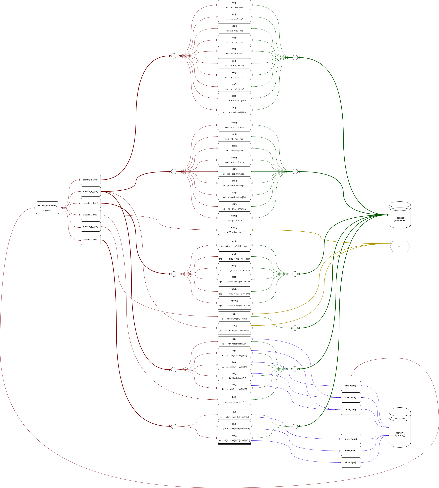
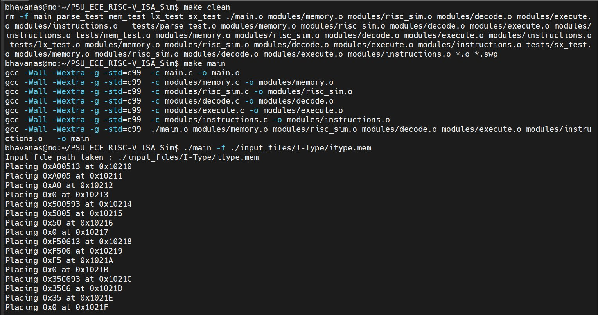
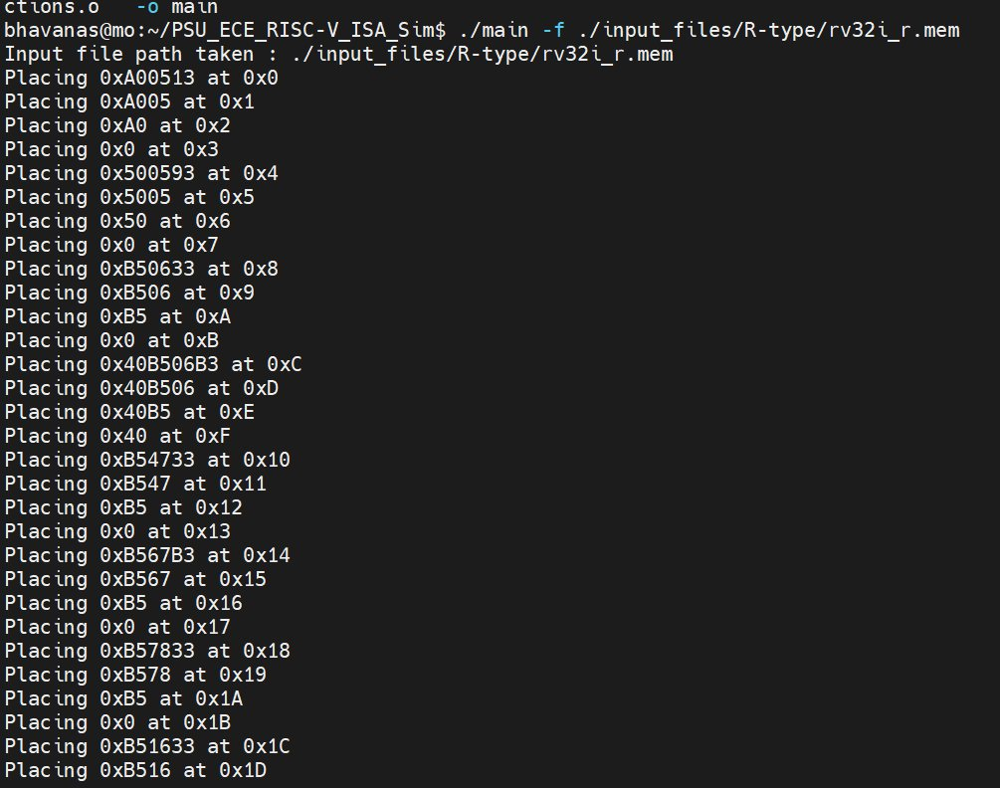
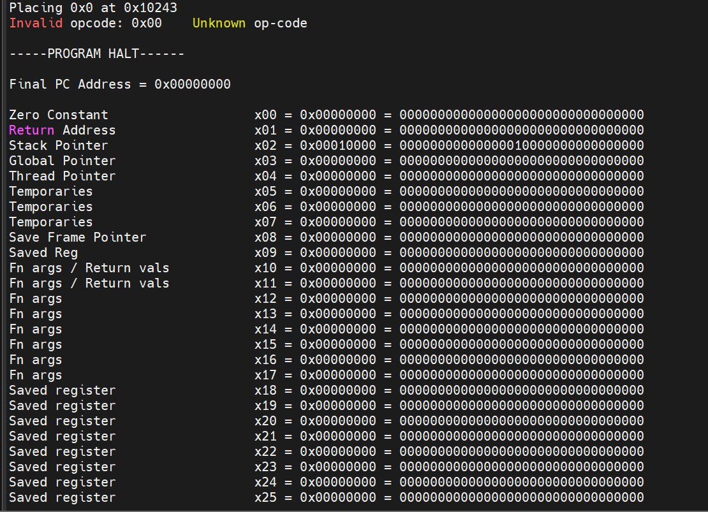

# PSU_ECE_RISC-V_ISA_Sim</br>
Simple RISC-V ISA Simulator; ECE 486/586 Winter 2025 Final Project</br>

[Test Plan Document](https://docs.google.com/document/d/1qdggXcx8wm82OrkbPRNxwOngLviSx2OqcZfvKck5cYE/edit?usp=sharing) </br>

## Overview

This project is a functional instruction-set simulator for the **RV32I** base integer subset of the RISC-V architecture, written in C. It loads a program image from a memory file, then runs a classic **fetch → decode → execute** loop: each instruction is read from program memory, decoded into its fields (opcode, `rd`, `rs1`, `rs2`, `imm`, `funct3`, `funct7`), dispatched to the handler for its instruction format, and the program counter is advanced (or redirected by branches and jumps). Execution continues until an unknown opcode is reached, which halts the machine and prints the final program counter and register state.

The simulator models a 32-entry register file, a byte-addressable memory, and a program counter, and supports all six RV32I instruction formats:

- **R-type** (opcode `0x33`) — register-register ALU ops: `add`, `sub`, `sll`, `slt`, `sltu`, `xor`, `srl`, `sra`, `or`, `and`
- **I-type** (opcodes `0x13`, `0x03`, `0x67`, `0x73`) — immediate ALU ops, loads, `jalr`, and system instructions: `addi`, `slti`, `sltiu`, `xori`, `ori`, `andi`, `slli`, `srli`, `srai`, `lb`, `lh`, `lw`, `lbu`, `lhu`
- **S-type** (opcode `0x23`) — stores: `sb`, `sh`, `sw`
- **B-type** (opcode `0x63`) — conditional branches: `beq`, `bne`, `blt`, `bge`, `bltu`, `bgeu`
- **U-type** (opcodes `0x37`, `0x17`) — `lui`, `auipc`
- **J-type** (opcode `0x6F`) — `jal`

## Architecture

The code is organized into a small `main` driver plus a set of modules under `modules/`:

| Module | Responsibility |
|--------|----------------|
| `main.c` | Argument parsing, hardware initialization, and the main fetch-decode-execute loop |
| `modules/risc_sim.c` | Argument parsing (`parse_args`), input-file loading (`parse_input`), and register printing (`print_bits`) |
| `modules/memory.c` | Byte-addressable memory model with `read_memory` / `write_memory` (with optional sign extension) |
| `modules/decode.c` | Decodes a 32-bit word into a `decoded_instr_t` structure |
| `modules/execute.c` | Per-format dispatchers: `execute_r_type`, `execute_i_type`, `execute_s_type`, `execute_b_type`, `execute_u_type`, `execute_j_type` |
| `modules/instructions.c` | Individual instruction implementations (one function per RV32I instruction) |
| `modules/types.h`, `modules/defines.h` | Shared data structures (`hardware_t`, `memory_t`, `decoded_instr_t`, `input_params_t`) and constants |

The diagram below maps how `decode_instruction` dispatches each opcode to its per-format execute path, and how those paths interact with the register file, the program counter, and memory:



## Build

```
To build use:

make main

Compile time argument flags.

-DVERBOSE -- Enable verbose output.
-DSTEP -- Enable key press instruction stepping.
-DDEBUG -- Enable debug output and define VEBOSE

Example:

$ make main EXTRA_CFLAGS="-DSTEP -DDEBUG"

Run time argument flags.
Default values are assumed when argument is absent.

-f <input file path> 
-s <stack Address> -- Starting stack address(Default = 65535)
-a <starting address> -- Word address(Default = 0)

Example:

$ ./main -f ./test_input.dat
```

The build is driven by `gcc` with `-Wall -Wextra -g -std=c99`. Besides `main`, the Makefile also builds unit-test executables (`parse_test`, `mem_test`, `lx_test`, `sx_test`); `make all` builds everything and `make clean` removes the binaries and object files.

## Running the Simulator

Build and point the simulator at a `.mem` program image with `-f`. As the program image is loaded, each byte is placed into memory at successive addresses (the simulator prints a `Placing ... at ...` line per byte as it loads). The example below builds the simulator and runs an I-type test program, with the load starting at the configured base address:



Running an R-type program image loads it the same way, byte by byte, into program memory:



When execution reaches an unknown opcode, the simulator prints `Unknown op-code`, halts, and dumps the final program counter along with all 32 registers — shown in hex and binary, annotated with their RISC-V ABI roles (zero constant, return address, stack pointer, etc.):



## Input Files

The `input_files/` directory contains assembly sources (`.s`), assembled objects (`.o`), and memory images (`.mem`) organized by instruction format — `R-type/`, `I-Type/`, `Btype/`, `J-type/` — along with combined and decode test programs. These provide ready-made program images for exercising each category of instruction.

## Tests

The `tests/` directory holds standalone unit tests built by the Makefile:

- `parse_test` — input parsing
- `mem_test` — memory read/write behavior
- `lx_test` — load instructions
- `sx_test` — store instructions

## Documentation

Additional reference material is in `docs/`, including `main_map.png` (the instruction-dispatch architecture diagram above), `RISCV_CARD.pdf` (RISC-V reference card), and the `riscV_sim.drawio` source for the diagram. The linked Test Plan Document above describes the verification approach.
