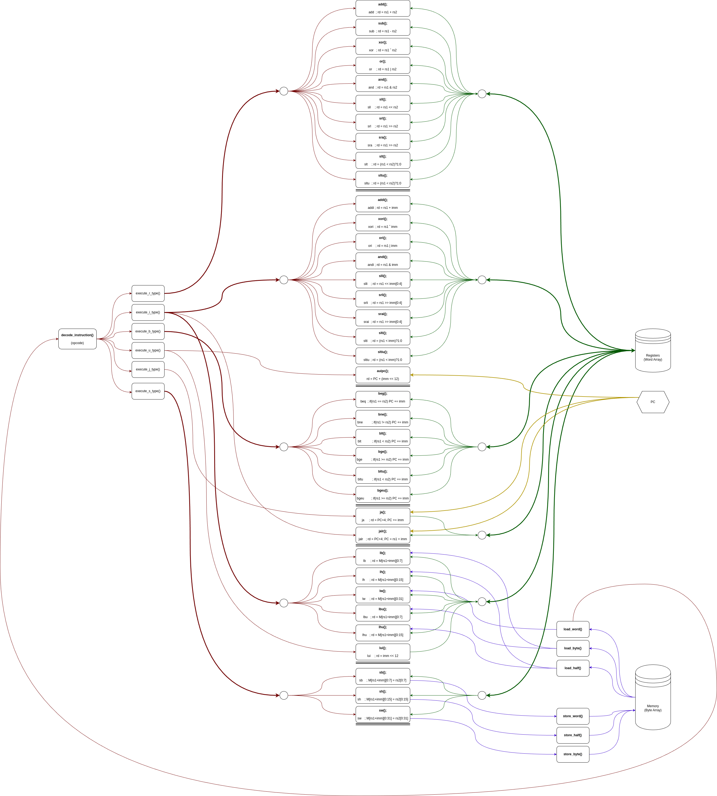

# PSU_ECE_RISC-V_ISA_Sim</br>
Simple RISC-V ISA Simulator; ECE 486/586 Winter 2025 Final Project</br>
```
Arguments are parsed using flags.
Default values are assumed when argument is absent.

-f <input file path> 
-s <stack size>
-a <starting address>
-ft <input file type>

Example:<

$ ./<app name> -f ./test_input.dat -s 128 -a 4096 
```


