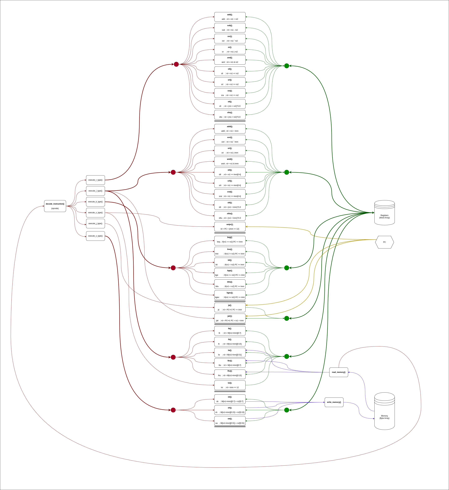

# PSU_ECE_RISC-V_ISA_Sim</br>
Simple RISC-V ISA Simulator; ECE 486/586 Winter 2025 Final Project</br>
```
To build use:

make main

Compile time arguments flags.

-DDEBUG_ON -- Enable debug output.
-DSTEP -- Enable key press instruction stepping.

Example:

$ make main EXTRA_CFLAGS="-DSTEP -DDEBUG"

Run time arguments flags.
Default values are assumed when argument is absent.

-f <input file path> 
-s <stack size> -- bytes
-a <starting address> -- bytes address
-ft <input file type>  -- 0 = seqential index, -ft 1 = word address index

Example:

$ ./<app name> -f ./test_input.dat -s 128 -a 4096 
```




